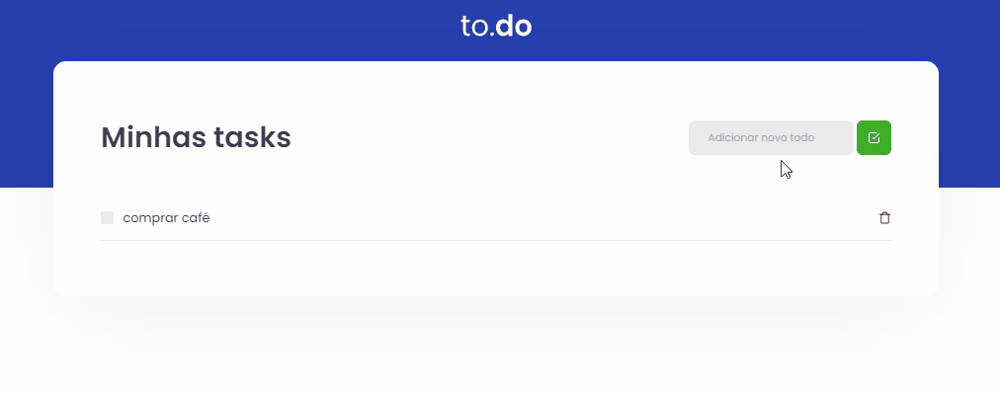

<h1 align="center">
  
</h1>

<h1 align="center">
  
</h1>

## 📋 Sobre

Aplicação simples para listagem de atividades a fazer, onde é possível adicionar à lista uma nova atividade, marcar como concluída e/ou excluír da lista uma atividade.

---

## 🎯 Objetivo
Este é um desafio proposto na primeira semana do bootcamp **Ignite** (Rocketseat) e tem como objetivo praticar os conceitos básicos do **React**, referente à manipulação do estado dentro dos componentes. 

---

## 🚀 Tecnologias utilizadas
- ReactJS
- Typescript
- Babel
- Webpack
- Sass
- Jest
---

## 🛠 Como baixar o projeto

```bash

# Clonar o repositório
git clone https://github.com/lucasdsaints/task-list-reactjs.git

# Entrar no diretório
cd task-list-reactjs

# Instalar as dependências
yarn install

# Iniciar o projeto
yarn dev

```

---

Desenvolvido por mim, Lucas A. Santos 😛!